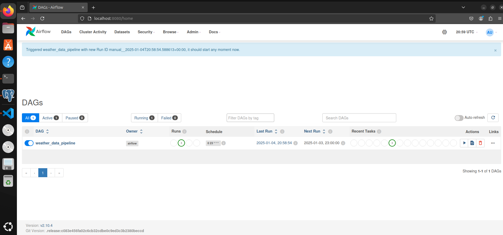
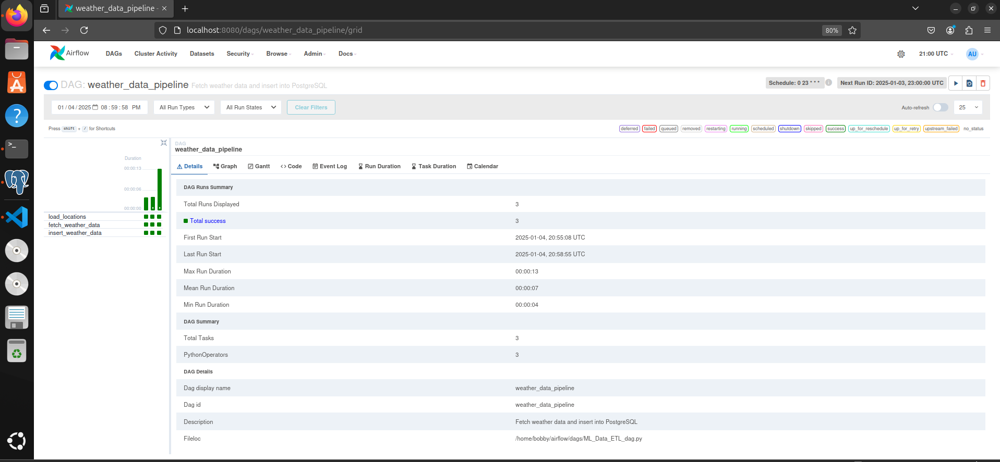
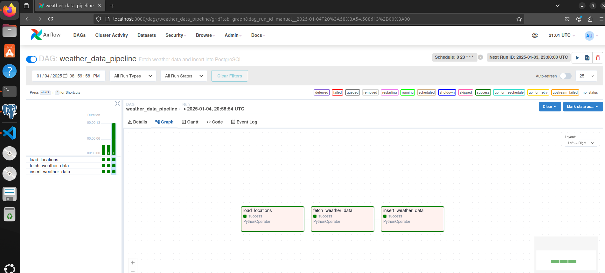
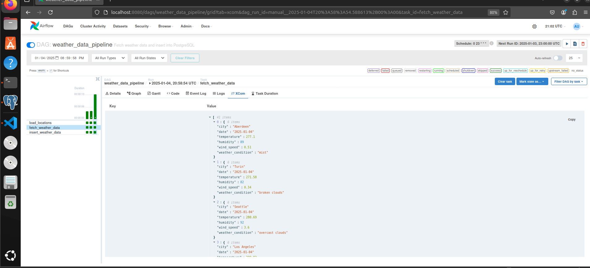

# AirFlow-ML-Data-Integration

This project demonstrates how to use [Apache Airflow](https://airflow.apache.org/) for orchestrating a daily ETL pipeline that fetches weather data from the free OpenWeather API, cleans and transforms the data, and stores it in a PostgreSQL database. It provides a scalable and reproducible example that can be extended for machine learning tasks such as training predictive models on weather-related datasets.


## Table of Contents
- [Overview](#overview)
- [Screenshots](#screenshots)
- [Features](#features)
- [Architecture](#architecture)
- [Setup Instructions](#setup-instructions)
  - [Airflow Setup](./Setup/Airflow-Setup.md)
  - [Database Setup](./Setup/Database-Setup.md)
  - [Folder Setup](./Setup/Folders-Setup.md)
  - [IDE Setup](./Setup/IDE-Setup.md)
  - [Airflow Database Connection Setup](./Setup/Airflow-Database-ConnectionSetup.md)
  - [API Connection Setup](./Setup/API-Connection-Setup.md)
- [Project Structure](#project-structure)
- [Contributing](#contributing)


## Overview

This repository offers a sample Airflow project integrating a daily weather data fetch from OpenWeather’s free API into a PostgreSQL database. The data is cleaned, validated, and ready for further downstream tasks, such as ML model training or dashboard visualization.

To run this project:

1. Follow the steps in the **Setup Instructions** section to configure your environment, database, and connections.
2. Download or clone the DAG and related codes in the exact same structure as described in the **Project Structure** section.
3. Use the Airflow UI to trigger and monitor the pipeline execution.

## Screenshots

Below are some screenshots showcasing the Airflow UI and the `weather_data_pipeline` DAG in action. These visuals provide an overview of how the pipeline is orchestrated within Apache Airflow.

| **Airflow Dashboard**                                            | **Pipeline Execution Detail**                                   |
|------------------------------------------------------------------|-----------------------------------------------------------------|
|   |  |
| **Pipeline Graph View**                                          | **Pipeline XCom**                                               |
|           |            |

### Screenshot Descriptions:
1. **Airflow Dashboard (AirFlow01)**: Displays the main Airflow UI with an active `weather_data_pipeline` DAG.
2. **Pipeline Execution Logs (AirFlow02)**: Showcases task logs and data retrieved from the OpenWeather API.
3. **Pipeline Graph View (AirFlow03)**: Visualizes the flow of tasks in the pipeline, including `load_locations`, `fetch_weather_data`, and `insert_weather_data`.
4. **Pipeline DAG Details (AirFlow04)**: Summarizes DAG execution details such as run duration, task statuses, and DAG configuration.

---

## Features
- **Automated Orchestration:** Daily scheduled runs controlled by Airflow.
- **Data Cleaning & Validation:** Ensures consistent, reliable data for analysis.
- **Modular Design:** Separate files for DAGs, database connection, and data processing.
- **Easily Extensible:** Add more cities, transformations, or ML tasks as needed.

## Architecture
```plaintext
┌─────────────────┐
│ OpenWeather API │
└──────┬──────────┘
       │ (Fetch JSON)
       v
┌───────────────────┐
│   Airflow DAG     │
│ (weather_pipeline)│
└──────┬────────────┘
       │ (Cleanup & Transform)
       v
┌─────────────────┐
│ DataProcessor   │
└──────┬──────────┘
       │ (Insert into DB)
       v
┌─────────────────┐
│ DatabaseEngine  │
└──────┬──────────┘
       │ (SQLAlchemy engine)
       v
┌─────────────────┐
│ PostgreSQL DB   │
└─────────────────┘

```
## Setup Instructions

To set up the project, please follow the instructions in the **Setup** folder in the following order listed below.

- **[Airflow Setup](./Setup/Airflow-Setup.md):**  
  Step-by-step instructions for installing and configuring Apache Airflow.

- **[Database Setup](./Setup/Database-Setup.md):**  
  Guide for setting up the PostgreSQL database, including creating schemas and tables.

- **[Folder Setup](./Setup/Folders-Setup.md):**  
  Instructions for verifying and setting up the required folder structure for your Airflow project.

- **[IDE Setup](./Setup/IDE-Setup.md):**  
  Guide for installing and configuring Visual Studio Code (or another IDE) for developing Airflow DAGs and helper scripts.

- **[Airflow Database Connection Setup](./Setup/Airflow-Database-ConnectionSetup.md):**  
  Detailed steps for securely setting up database connections within Airflow.

- **[API Connection Setup](./Setup/API-Connection-Setup.md):**  
  Instructions for obtaining an OpenWeather API key and securely adding it as an Airflow connection.

## Project Structure

The repository is organized as follows:

```plaintext
AirFlow-ML-Data-Integration/
├── dags/                       # Airflow DAGs for ETL orchestration
├── data_processing/            # Scripts for cleaning and transforming data
├── database_engine/            # Database connection and query helpers
├── Setup/                      # Setup instructions (Airflow, database, etc.)
│   ├── Airflow-Setup.md        # Airflow setup steps
│   ├── Database-Setup.md       # Database setup steps
├── tests/                      # Unit tests for the pipeline
├── README.md                   # Main project readme
└── requirements.txt            # Python dependencies
```


## Contributing

Contributions are welcome and appreciated! To contribute to this project, please follow these steps:

1. **Fork the Repository:**
   Click the "Fork" button on the GitHub page of this repository to create a copy under your own account.

2. **Create a New Branch:**
   git checkout -b feature/your-feature-name
   Choose a clear, descriptive name for your branch that reflects the changes you’re making.

3. **Make Your Changes:**
   - Add or modify code, tests, or documentation as needed.
   - Ensure that your code adheres to the style and format defined by this project (PEP 8 for Python).
   - If you are adding new features, include tests or update existing tests to maintain coverage and confirm that your additions work as intended.

4. **Run Tests:**

   Example test command
   ```bash
   pytest tests/
   ```
   Make sure all tests pass and there are no regressions.

5. **Commit Your Changes:**
   ```bash
   git add .
   git commit -m "Add your commit message here"
   ```
   Write clear and concise commit messages that explain what your changes do.

6. **Push and Open a Pull Request:**
   ```bash
   git push origin feature/your-feature-name
   ```
   Go to your forked repository on GitHub and open a Pull Request (PR) against the main branch of this repository. Describe your changes, why they’re needed, and how to test them.

7. **Code Review and Feedback:**
   - Be open to feedback and make the requested changes where applicable.

8. **Merge:**
   Once your PR is approved, it will be merged into the main branch.

**Note:** If you’re unsure about any aspect of your contribution or would like to propose an idea before coding, feel free to open an issue first. Constructive discussion helps ensure we move in a direction that benefits the entire community.
